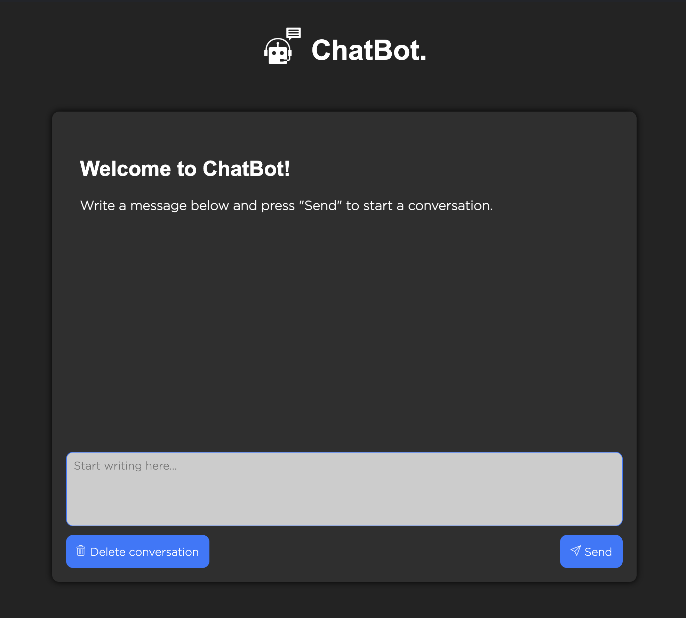
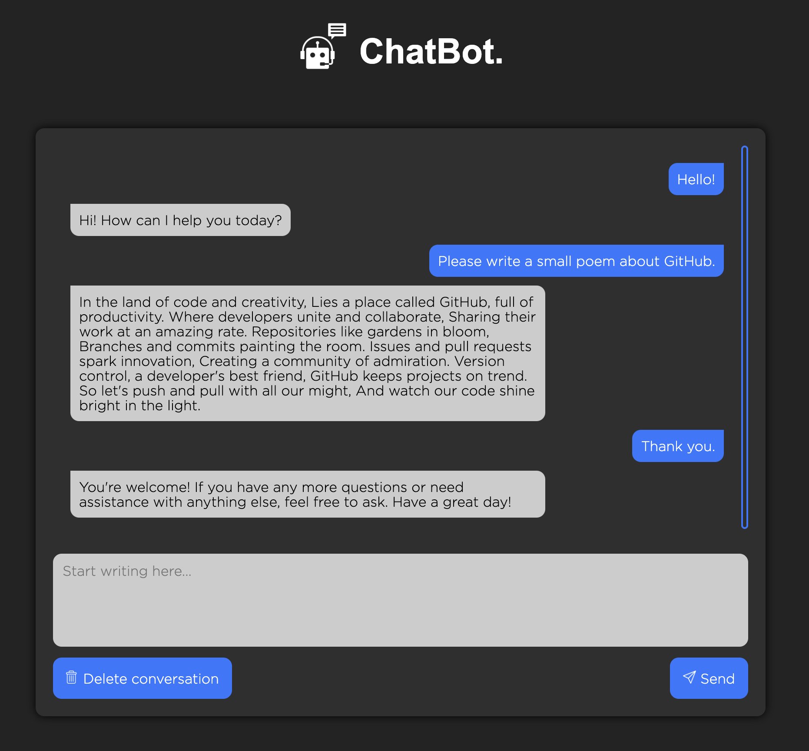

# ChatBot

A simple integration of the OpenAI API to create a chatbot using [Python](https://www.python.org/) and [Flask](https://flask.palletsprojects.com/en/2.0.x/).

## Setup and Usage

1. Clone the repository:

    ```bash
    git clone https://github.com/timothja/ChatBot.git
    cd ChatBot/src
    ```
2. Install the required packages:

    ```bash
    pip install -r requirements.txt
    ```
3. Create a `.env` file in the src directory and add the following:

    ```env
    API_KEY="your-api-key"
    ```
    Replace `your-api-key` with your OpenAI API key. You can get an API key here: [https://platform.openai.com/api-keys](https://platform.openai.com/api-keys).

4. Run the application:

    ```bash
    python3 app.py
    ```

5. Open your web browser and go to [http://127.0.0.1:5000](http://127.0.0.1:5000)

## Screenshots





## License

This project is licensed under the Apache License 2.0 - see the [LICENSE](LICENSE) file for details.
